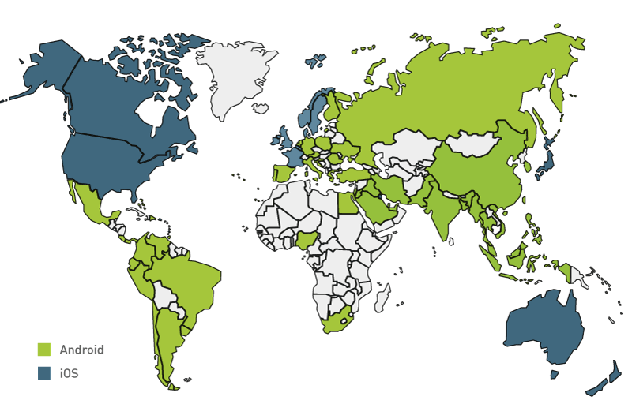
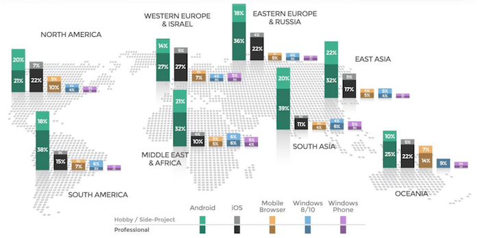

This article doesn’t try to say that one of them is better than the other one. In this post we want to probe if an app on Android or iOS is more convenient for your project at the beginning, taking in consideration the market you will approach, the customer's profile, and other details of your tech business idea. 

**Android vs iOS** is an eternal war from which many have written, but the truth is that each one is very good. Each one has advantages and disadvantages, and you can use it in a really nice way. 

What will make the difference will be how useful can be each one for your business and which can take you to success. At least at the beginning, then you succeed in one platform, and then you can start creating for the other one.

<title-2>Android vs iOS: a little bit of the history</title-2>

Android was first but now both are at the top of the market. 

Android was born in 2005 as Android Inc, but in 2007 things changed thanks to the arrival of iOS. Google bought Android and they had to change it and get it better in this year until launching again from the hand of Open Handset Alliance foundation. From there, the war began.

But the truth is that Android and iOS win the battle depending on the world area we are. In some countries, Android is the most used but in others, iOS is the absolute winner. 

In the beginning, Android’s team want to create an OS based on Linux, and they achieved it. But in 2007 they evolved when Apple made its magic making a mobile OS simple, really, functional, easier to use, and tactile, while Android was criticized to look like a Blackberry copy. 

Why they had to do this? Because they had more competition. Before of iOS from Apple, Android was alone on the top of the market, and blackberry was its only companion.  

After the release of iOS, they achieved to make Android tactile and really competitive in the market. 

When both were in the market for the first time in the country, Android was the winner in sells. But in 2008 things changed and iOS take the first place. But be careful, only in the United States. 

How we know, apps for these OS are different even taking into consideration the platform where customers are going to download it. For iOS will be the App Store while for Android your app needs to be on the Google Play Store. 

For each OS you need to develop a different App, so, at the beginning is usually a good practice to select the best option for your project to lower the costs and time of releasing your product to testing.

Very popular technologies like [React Native](https://facebook.github.io/react-native/) and [Nativescript](https://www.nativescript.org/)Nativescript exists to try to reduce the breach between developing apps for each platform completely separately. These technologies allow you to use a cross-platform approach to reuse efforts and developing a single app for both systems, but still, for each scenario, specific modifications need to be made.

Whenever you decide to focus your efforts on one single platform it’s common to name these efforts as Android First Development or iOS Frist DEvelopment.

<title-3>Android App for your business</title3>

**Advantages**

* Android covers more people in general in the world. In some places, iOS is the winner, but if we take a general view in the world, Android is a little higher than iOS, and this could mean more people can have access to your product. These numbers have been the same since 2007. 

Source: [AppAnnie](https://www.appannie.com/en/)

* More reviews and contact with customers’ opinions. It is possible this could be thanks to the number of people using it or maybe thanks to the tools on Android and the Play Store to make reviews. But it has shown in many cases that apps on the Google Play Store have more reviews, comments, and interaction from users. 
	For example:

Source: [Diegolaballos](https://diegolaballos.com/blog/por-que-crear-una-aplicacion-para-android/) 

* More developer options
This advantage is related to all developers and people who work with this technology. There are more people nowadays with Android than iOS. This means more people opt to work with you and you can select the best options.

Source: [Vision Mobile](https://www.visionmobile.com/reports/developer-economics-state-developer-nation-q3-2016)

**Disadvantages**

* If you are in the US it is a disadvantage to have an Android App First. This country is the maximum consumer of iOS. 
* Android is a little bit unsafer than iOS, referring to hackers, virus, and malware.

<title-3>iOS App for your business</title-3>

**Advantages** 

* Statistics show that [iOS users are more willing to expend money buying apps](https://medium.com/@the_manifest/android-vs-ios-which-platform-to-build-your-app-for-first-22ea8996abe1) or doing in-App purchases than Android users, this is probably mostly because the great user base for iOS it is seated in North America who rules the world in terms of online spending. 
* iOS is a little bit safer than Android. It is almost impossible hacking, steal, or falsifies information in the OS. Apple is very careful with security. You always be safe of your App won’t be plagiarized. 
* Exclusivity. Apple has a politic of exclusive products for is OS. And high quality also is implied.

**Disadvantages**

* Develop an iOS App is more expensive than Android. In the last, the offer is lower, and also all tools and original materials of Apple you need are more expensive and exclusive. 
* Develop for iOS is stricter. You need to pass verification first which can take you 2 - 3 or 4 weeks. You have to keep in mind more details before launching it. Android is less strict. This characteristic could be good or bad depending on the point of view you see it. 
* To develop an IOS app you need to own a Mac, it is not possible to develop in other system or hardware.

**Is it a good idea to develop in both versions?** 

It could be. You can do it, but you have to know that implies more effort, people involved, resources, time, and it has more risks.

You can do it, but we recommend you to focus on one and then expand.

**Developers for Android App and iOS App are the same?** 

Not necessarily. Nowadays nothing is impossible. There are people really talented and that’s why you could find a developer who has enough knowledge in both, but this is so difficult to find. 

Each one is really complex, extensive, and different. For that is so difficult to find an expert on both platforms. 

We don’t recommend you that. People commonly specialize in one of them to be better. 

In conclude? If you will develop an iOS App looking for an iOS developer, and the same for Android.   

The battle between **Android vs iOS** began in 2008 and now on continues. But the reality is that both can work for you depending on the necessities, goals, market, and other aspects of the app you will develop. So, think twice which platform is more convenient, taking into consideration some of these facts we showed you, select the best team for working, and go as high you imagine.
