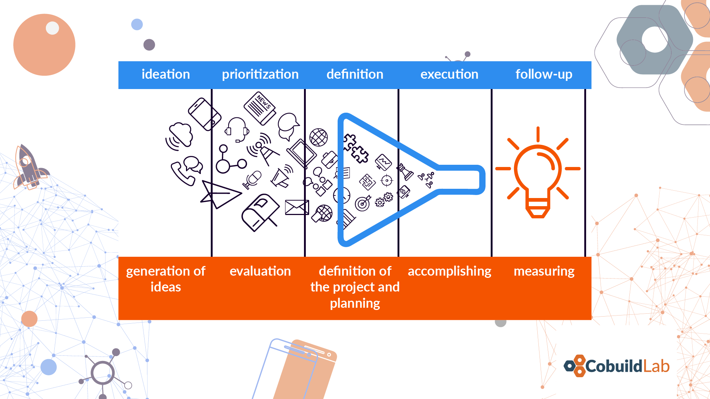
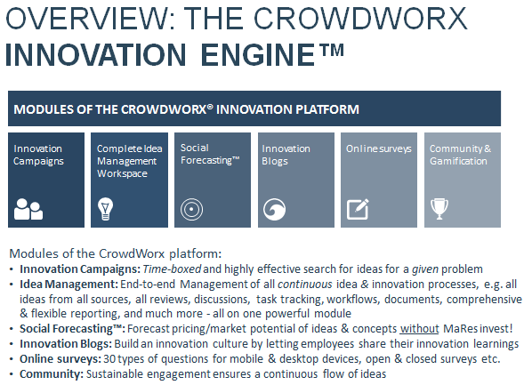
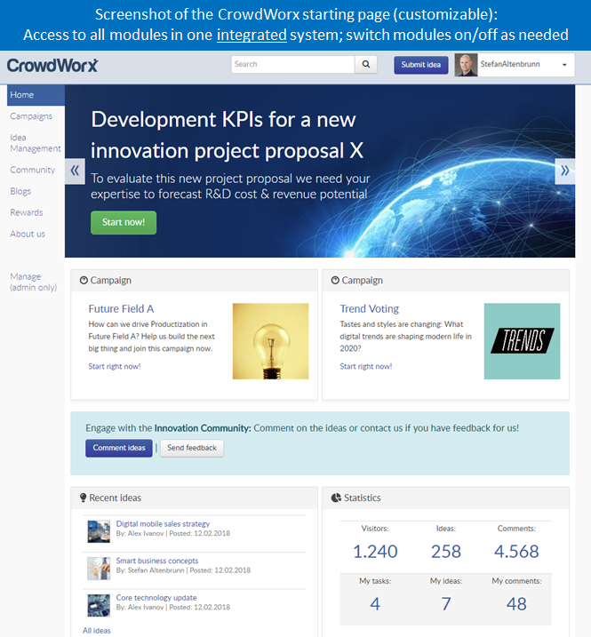
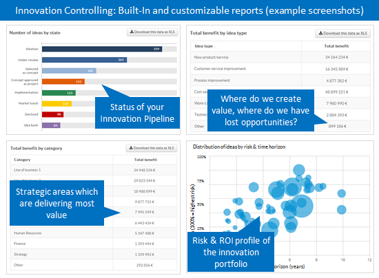

The world of entrepreneurship is about opportunities. About business opportunities, market opportunities, opportunities to develop an idea, etc. But these opportunities often have to be worked on or found. They do not come by themselves and even less today that we have so many saturated markets, a lot of information, a lot of offers, a lot of software solutions, etc.

That's why we decided to create this post,  so that you know how to search, identify, and work in and opportunity for developing it, make it relevant, effective, and efficient, and more critical, transform it into a software that satisfies a market need, and above all, your personal and business expectations. Welcome, and let the action begin.

<title-2>Identify an opportunity to create a software product</title-2>

If you want to start a software business and to find an opportunity in this market, you must know that there are **three essential processes** which you must do.

The first process it is **the context**; we mean all personal conditions of your life, as well as the conditions of the environment that surrounds you, your experience, relationships and connections.

The second is **idea generation**, that way of calling and organizing ideas, finding an exciting proposal to do, and unleash creativity.

And finally, there is the **process of innovation**. A word that you have heard a lot, and we will define concretely, and find some practices because it is fundamental. Especially for seeing an opportunity in the software market.

<title-2>Process 1: Evaluate your Context</title-2>

The context is your reality. What you have? Who are you? What do you do? What problems or situations you have? What you surround yourself? How do you do it? All that information about the environment in which you are, which conditions how ideas reach you. That can inspire you as well as stagnate you. That's why it's so important, because the conditions of the environment will have an influence on your creative process and development as a software entrepreneur.

Therefore, if you don't have an ideal environment for the constant and free flow of ideas for business or ideas for any project, it's likely that you won't find an opportunity or you will find an opportunity that is not the best. 

This context has the following constitutive elements:

* **Work Experience** because experience gives you learning and background that often surpasses the theory, a market or a type of products. It is not the same as a person who has no experience in business processes develops [Enterprise Software](https://cobuildlab.com/blog/enterprise-software-development/), as one who does have the knowledge and is even more involved with the process that is going to be automated with the software product. 

* **Relationships and connections** due to the alliances, you can get and all the contributions that third parties can give you. That's why people say that two heads think better than one.

* **Problems that you are facing and that you have resolved**. The opportunity on the market will be determined for the problem you can solve to a group of people with your software.

* **A creative environment**. If you are in the wrong space your ideas will not flow.

* **What you have studied.** You will need enough knowledge and comprehension of an area, situation, and even a type of people to determine the correct opportunity. 

* **Passed experiences with software products.** Every experience gives you an idea of what might and might not work. [If you think as a consumer you will better understand what your consumers want](https://cobuildlab.com/blog/customer-development-process/), and past experiences with software can help you with this issue, even if in this first process, do not develop your ideas as such, but simply collect and become aware of that knowledge you already have with you, to begin your creative process.  

* **Your desires or dreams as people.** There is no better engine to find opportunities and see things that others do not than desires. A goal you want to achieve. Your software product. It is recommended that you give form to that context of your life, before starting the ideation phase. 

* **Your routine of to-dos.** Routines and things to do, help you get organized, develop your discipline, and know everything you need to optimally exploit the creative process until you find the opportunity you have always wanted to create a software product. 

<title-3>Pieces of advice for the context</title-3>

**First of all**, your context must inspire you, it must lead you to more, it must have the necessary elements and stimuli to keep you motivated and in a creative wave of entrepreneurship.

This is the reason why many people attend coworking spaces, seek allies and try to surround themselves with people who have the same concerns and desire to undertake a project.

These people and spaces are contagious. They provide ideas, emotions, even good vibes, all necessary for creativity to flow, vision and mind are opened and can analyze more options that lead you to identify the best opportunity to develop a software solution.

**Second**, you must learn about entrepreneurship. One of the most important elements of the context when working on a software business idea is the topic of training and education. If you already know about business, it helps you a lot, because you can have notions of what is viable and what is not when conceiving a business from scratch, from its idea. 

But the same goes for software. If you are not an expert in the area, it doesn't matter, but what we do recommend is that you attend Meetups, conferences, local events, courses, or if you are more of the type of person who likes self-learning, then you should investigate a lot about how to develop a software project, what tools you need, how to create an idea, how to validate it, and so on. These are steps that you will have to follow later, but having this information within your background will add a lot when looking for an idea.  

You can even evaluate looking for help, advice from software experts who can explain if your idea is on the right track, what you need in terms of resources on how to plan to build the solution. What is viable and what is not, or just that you are oriented. Having knowledge and location in the subject of software and business is very important in your personal or work context to find an opportunity in the market and develop it as a software product. 

**In the end**, flow as much as you can, give free rein to creativity. Think of experiences you already had, dare to write or think outside the box, make unusual proposals and write them down, that in the second pillar you are going to perfect them and give shape to each one of them from an innovation point of view. The theme of context related to creativity can even be fun. Be passionate about the software; be motivated as much as you can.

<title-3>Process 2: Generate the ideas</title-3>

When you have an ideal context for creativity, good things would happen. We know this stage for this purpose as a generation of ideas. 

The moment of brainstorming is the basis of the innovation process and is almost the secret for achieving your goal and find an opportunity to develop software. 

Brainstorming is usually based on specific questions you ask yourself: 

What do I think? 
How can I do it? 
What do I need? 

And all these essential questions that can lead you to create an idea, a concept from scratch that you are going to process to be an innovative value proposition. 

Something that always helps is to **define or at least think about the opportunity that we would like to generate** and start thinking and letting the creativity flow in this respect. 

Before you start generating ideas, **gather information as much as possible**. Identify what you already know about the issue and what information is still needed, become an expert on the subject by following influencers on the matter, subscribing to newsletters, reading publications, investigate potential competitors, etc.

Once you have enough information, it's not a bad idea to **involve more than one person in your creative process**. As many says, two heads think better than one.

But be selective about who you involve. It must be a person who adds, who has vision and motivation similar to yours. And preferably, that knows something about software or at least the area that you more or less plan to cover with your software product.

Set your goals far away. From this first phase, which is the idea to find an opportunity, it is necessary to establish an objective or at least what you would like to achieve with the activity. 

In this brainstorming process, some **tools can also help you**, mainly to make them sustainable or at least try to define their sustainability over time. 

The tools can help you to organize the ideas a bit as if they were a backbone. And you could even begin to classify them and facilitate the next step that would link to definition and innovation. 

For example:

* [Stormboard](https://index.co/company/stormboard?utm_medium=referral&utm_source=https://thenextweb.com&utm_campaign=post_wk14_1), which is a tool that gives you virtual post-it that you can share and track.

* [MindJet](https://en.wikipedia.org/wiki/Mindjet). A mind mapping tool that helps with free-thinking. It is easy to use and very intuitive. Ideal for meetings where you need to organize ideas and create strategic plans quickly.

* [Mind42](https://mind42.com/). Software that runs on the browser to create mind maps, structuring a diagram where you can visually organize information or ideas from a brainstorm.

At this point, all that's left is to think and let your imagination run wild. Don't dismiss ideas, even if they're very crazy and unusual. Sometimes the most unimaginable things can lead to exciting things.

<title-2>Process 3: Innovate</title-2>

Innovation is a process.

The ideas you can generate or have in the second process of the road to find an opportunity and turn it into a software product, by themselves do not bring innovation whether they are 100% out of the ordinary. 

If you want to talk about innovation, it is necessary that all those dispersed ideas that you had to go through a systematic process where they are going to be purified, defined and general lines where they are going to be managed. 

This process is the process of innovation, defined as the process where the ideas you generated in the previous brainstorming are organized, prioritized, defined and evaluated, either alone in the ideal spaces or in the company of the right people and with sufficient knowledge in the area you want to define as a software business opportunity. 

Although the steps look generic, the truth is that they are not, because the key to innovation is in the previous generation of ideas. The overflow of creativity that in this phase, you must give form and sustainability over time, as well as a value proposition creative enough to be innovative.

The result of the innovation process is an opportunity (or several), a software product in this case, that offers a **proposal of value** in the market or at least with a different touch to what you have already known up to that moment of what you consider your market. Because at this point in the process of developing a business, the market has not yet been studied in depth. And not only that. Innovation also refers to the **sustainability of the idea** in time and even the subsequent **measurement of the idea** after it is executed.

Only when an idea meets these requirements we can say that it is a real opportunity.

<title-3>Techniques and practices for innovate</title-3>

* **Opposite Thinking**

The technique of the opposite thought is the perfect definition of its name. In it, the participants must think precisely the opposite of what is reasonable; they can even think in different orders, start at the end, etc. In this way, unconventional ideas and solutions are found. 

Here we share the step by step for you to understand it better. 

"1. Individually list two assumptions you have about the problem you are trying to solve or about solutions that you have in mind (10 min). 

2. Individually pick an assumption and define one or two opposite realities in the second column (5min). 

3. Individually think about these new realities, how it affects your problem and add potential solutions to the third column (5min). 

4. Keep repeating levels 3 and four until you have identified opposite realities and potential solutions for all assumptions (10 min). 

Tip: Don’t hesitate to build upon the opposite realities of proposed solutions of your team members!

5. Review all proposed solutions as a team and build on each other idea (20 min)."

**Source:** [Board of Innovation](https://www.boardofinnovation.com/tools/opposite-thinking/)

* **Brainstorm Cards**

Brainstorm cards are a technique where different trends of the moment, and external factors, are considered to generate ideas per pile as much as you can. 

You will write these dozens of ideas on the cards, categorize them by each of the trends or factors you considered, and then debug them. 

What you should make sure is to choose a period to think and write everything that goes through your head. There are no limits, and no matter how crazy the idea may be. Every thought can work. 

If you want to have an idea about what to write about or at least get started, let's share with you the trends and external factors that this activity usually focuses on. 

1. Consumer Momentum Trends

The fashions, the trends you see that are in the market and that people love and that sometimes leave a need in the minds of people that you can be satisfied with your product. Even you would learn from these cutting-edge ideas and use design thinking to predict what's next and do it first. 

This trend you can put it together with another validation technique we explained before called [Customer Journey Map](https://cobuildlab.com/blog/practices-for-validating-your-business-idea-for-your-software/). We invite you to read it, but basically, it is the route of a customer for knowing him or her better. 

These are some examples:

A) What if you could reframe your service into bite-size components?

"Duolingo turns the lengthy process of learning a new language into a playful list of small, easy 5-min lessons. They make their service free by using their students to translate bits and parts of articles. Companies like CNN and Buzzfeed pay Duolingo for this service."

B) What if you used [gamification](https://en.wikipedia.org/wiki/Gamification)?

"Think of ways to make using your product or service fun for customers. You can add levels, social rankings, perks, awards, missions, and scores. Waze, a “sat-nav” traffic measurement system, for example, awards points for every km driven or every report added. These reports are so accurate, many car manufacturers such as Honda are leaving TomTom for Waze."

C) What if you could predict customer behavior?

"Think of ways to quickly answer customers’ needs by predicting them. Amazon patented a system for predictive logistics: based on buying trends, your searches, and regional data, they send products to warehouses close to you, even before you buy them."

In the same way, you can use technology trends, such as those used by Google, Amazon and [Apple](https://cobuildlab.com/blog/ios-app/) putting a voice to their virtual assistants. [Artificial intelligence](https://cobuildlab.com/blog/artificial-intelligence-in-2018/) somehow profitable, [blockchain](https://cobuildlab.com/blog/blockchain-revolution-in-business-world/), and so several trends that are setting the tone and can offer many advantages to the software product you want to develop.

Also, you can use market trends, regulation trends, among others. 

* **Analogy Thinking**

Analogies are techniques where information of a determined situation is used in another one for several reasons. Because they are similar or they could be in a comparison, etc. 

In this innovation technique itself, information from one source is used to solve a problem or opportunity in another context.

An example in which you can apply this innovation technique is studying a much larger and more successful business with which you can identify. 

Determine what makes it great according to your criteria, and those principles give them your essence and use them as a basis for your software business idea. 

This is an effortless method for coming up with new ideas that are pre-validated.

Uber is an excellent example of this type of business idea, which with the help of innovation could be made a place in a market and with a pre-existing and prevalent product, such as private transport, taxis.

* **Use technology as a help for innovation and Idea Generation**

The previous, are traditional methods which you can use on your own, or accompany a group of people to apply it and shape the ideas you already have in mind. But if you are more of a technical team, for you, there are also options to find your opportunity to develop software.  

Several tools in the market are intended to help you manage your innovation process, be it in a personal environment or also in a work environment, business, etc.

Some of these tools we mention below:

[IdeaWake](https://info.ideawake.com/get-started-with-ideawake-today?utm_campaign=capterra&utm_medium=cpc&utm_source=capterra)

"Idea Management Software that Helps Add Millions to Your Bottom Line". This is their concept and value proposition. Know it better with this video

<youtube-video id="IvMc8y7HAKM"></youtube-video>

It has exciting options to offer to range from 

* Brand customization to 
* Job accounting
* Gambling, 
* Access from anywhere in the world, whenever you want, 
* Single sign-on, and several options that allow you to manage the process of ideation and innovation. 

The promise they make to you as a product is that with the tool, you will be able to start applying 5% of the innovative ideas that will drive 95% of new business results.

[IdeaDrop](https://demo.ideadrop.co/innovation-software-gdm/?directory=innovation&utm_source=capterra)

"The Idea Drop idea management tool helps you harness the collective intelligence of your employees to solve business challenges faster." This tool is different but also it is very popular. 

This application offers:

* "Social Interactions

Use @mentions, intelligent #hashtags, comments, link sharing, and real-time notifications.

* User Innovation Scores

Measure the innovation performance of individuals based on their participation.

* Innovation dashboard

Get a real-time snapshot of what's happening across the platform with our native mobile app  (iOS and Android).

* Robust Reporting

Create, edit, and export reports and analytics to track successes and areas for improvement.

* Idea Cloaking

Your colleagues can choose to 'cloak' to hide their identity when dropping an idea, and may 'uncloak' later on.

* Innovation Pipeline

Get a visual insight into the progression of ideas and drive continuous improvement via Pipeline. 

* Intelligent Duplicate Check

Scan the entire history of all the ideas shared using pattern recognition technology to flag ideas that look similar.

* Bulletins

Quickly post updates to colleagues when ideas have been actioned or implemented.

* Smart Search

Use Idea Drop as a valuable internal knowledge base with powerful smart search functionality.

Idea Drop is intuitive, removes hierarchical barriers, and makes it faster to get help and support across the business.”

[CrowdWorx Innovation Engine](https://www.capterra.com/p/148239/CrowdWorx-Innovation-Engine/)

"CrowdWorx is an End-to-end Innovation Management software covering the full innovation and idea management process." Full coverage of the process sounds quite interesting due to the complexity of the process and that never really fits. It is an endless cycle. That's your proposal to us. 

And so on. All of these tools can help you with the innovation process at the time to create or define an opportunity in the software market, and they can even help you after you develop your software. 

We share in images some of the benefits you can get with this innovation management tool. 

**Source:**[Capaterra](https://www.capterra.com/p/148239/CrowdWorx-Innovation-Engine/)

* **SCAMPER**

This technique does not apply to creative business processes from zero, but it is often used in a corporate environment.
 
However, we consider it prudent to mention it because it is a good practice that helps innovation. The Innovation process, you must continue applying it even after you find the opportunity in the software market. In that way, you will not fall behind your competition, and always you will cover the needs of your end-users. 

The SCAMPER technique is holistic, and was developed by Bob Eberle and consists of 7 phases: 

1. Substitution of the product, the process, or whatever you want to innovate. 

2. Combination of two or more ideas after you have had your brainstorm, to put them together and make them better. 

3. Adaptation of the process or product so that it is more flexible and can be further improved. 

4. Modify effectively, focusing on improving the results and not the idea alone. 

5.  Finding a new use for the idea you've already improved and it gives you good results. In this way, you see future benefits that you can obtain in other processes or products with the same solution that you already found. 

6. Examine the possible results if one or more parts of the concept you have already created are eliminated. 

7. Reverse the order of interchangeable elements of an idea.

The good thing about this technique is that it defends the principle of innovation from ideas that already exist. In other words, if you have two ideas and they are not working well separately, put it together, and adapt them. Results could be significantly improved. That's innovation. 

