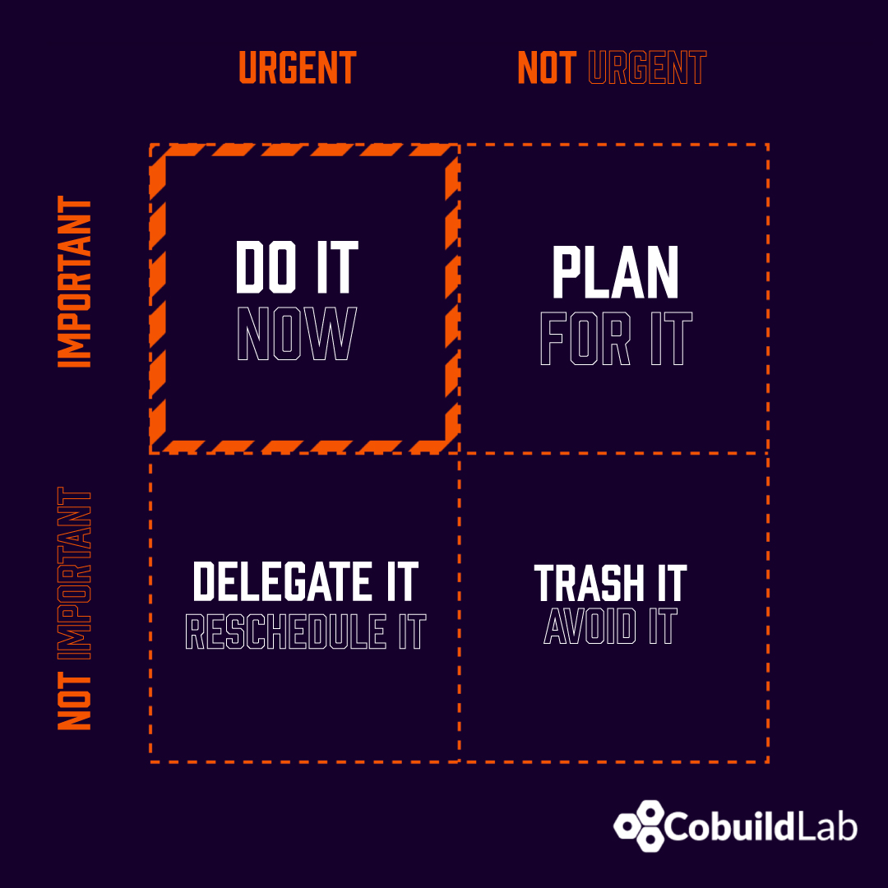

Dear entrepreneur, if you’ve reached this point, congratulations!. You must have a business idea, a defined opportunity in the software market, and at least, the will to  take the first steps.

But this is not enough. Being in charge of a growing business requires specific skills, training, and individual qualities that you should start developing right away. The most important of them all? **Leadership**. But don’t worry, we will give you some tips on this subject, as well as new trends that have emerged, so you can take advantage of this, guide your team, and put your software project on track.

<title-2>Becoming a Leader</title-2>

**Leadership is a managerial skills that a person has, in this case, you as an entrepreneur, to positively influence the way your team acts, thinks 'and' works by transmitting energy, enthusiasm, organization 'and' everything that is needed to complete a task, meet an objective, and reach the final goal**. A leader, should be able to delegate, motivate, manage, solve, promote, and evaluate the project he or she must lead.

Some of the most important tasks a leader performs, are related to the organization of their team. the establishment of goals and activities, building team cohesion in order to work in a synchronized manner achieving the goals that were established. In essence, the leader is the person in charge of developing and making the project grow. 

Even though it is rare,  leadership positions can be taken by a person who is not necessarily the founder, or the one who conceived the ideaThe truth is, that as an entrepreneur you should be the leader of your company. You know the idea, and the value proposition of your project, that is why you should guide the team.. For this reason, we present some tips that will help you find and develop the leader within you.

<title-2>Now, enjoy these Leadership tips</title-2>

<title-3>1. Make a template of your management</title-3>

When you have enough information for establishing activities and goals for the team, develop your plan and present it in a template to the them. . That way, everyone will know the macro plan and better understand just how important each of their responsibilities are.

In the development of a software product, every piece is fundamental, it has to work like clockwork. If any member doesn’t fulfill their responsibility or reach the goal assigned, they will affect the whole development cycle of the project, wasting time, and in a best case scenario, you will lose money. At worst, the quality could be affected, hindering your company’s growth or even damaging your company’s reputation. 

<title-3>2. Be as humble and accessible as you can</title-3>

Humility, empathy, and confidence are essential characteristics of a leader. When you are responsible for many aspects (technical or not) you are likely to feel pressured. Or on the contrary, if you feel so comfortable in a position of authority that can change your kind attitude, respect, empathy, and openness for other members of your team. Avoid this type of situation, since you would go from being a good leader to a bad boss, and this position is an antonym to the expected one.

<title-3>3. Communicate as much as you can with your team</title-3>

You can use any tools you want for this or do it face to face. The most important thing is that you always talk to the people who make up your team. This way, they know each other and get along better. With better communication you will be able to better motivate your team, transmit ideas, and get immediate feedback from those who are going to support you to make your dream a reality. 

<title-3>4. Identify and set your priorities, then share them</title-3>

There are important, unimportant, urgent, and non-urgent things. There is a prioritization exercise in which a picture is drawn divided into four spaces with these characteristics in each sector. The division would be this way:

