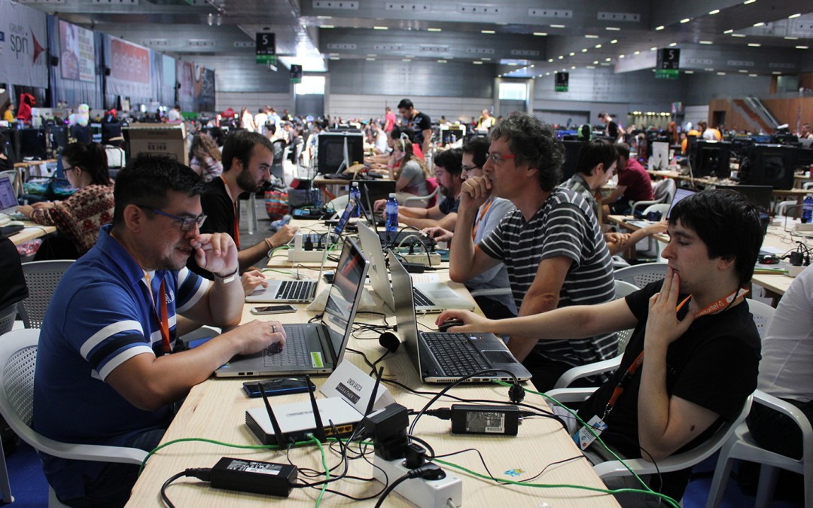

Currently, it is common to see a few women in an informatics career classroom and a clear majority of men. But **what happens that women are not interested in studying this profession**? Is it something just for men? Or is because the market only hires men?

In recent years, **many informatics and technology companies in Silicon Valley have been denounced for cases of discrimination against women**, who do not have the opportunity to be promoted in their areas. It is not a lie that the most popular technology companies have been created by men, such as Google, Apple, Microsoft, Facebook, Twitter and many more.

The history of women in science and informatics is limited. According to[ El Nuevo Diario](https://www.elnuevodiario.com.ni/opinion/476709-generacion-ninas-preparadas-inclusion-digital/), **women have 20% fewer opportunities to occupy a directive charge in the mobile telecommunications industry.**

But is the reason for this scenario a matter of preference or are they copying the models of their home? Microsoft had this doubt and did a study on 11.500 girls in Europe. **Those with female models working in science or technology showed more interested in science, technology, engineering and mathematics matters than girls who do not know women in this sector.**

This means that the models and examples in our homes are decisive in choosing the profession we are going to perform as adults.

 

 

However, there are also other reasons to explain this gender disparity. Access and connectivity to the web are unbalanced. According to a study of the Organization for Economic Cooperation and Development (OECD), **250 million women in the world have less Internet access than men. **

The[ Digitalization and the American Workforce](https://www.brookings.edu/research/digitalization-and-the-american-workforce/) report says that between 2012 and 2016, "women, **with slightly higher aggregate digital scores (48) than men (45), represent about three-quarters of the workforce in many of the largest medium-digital occupational groups**, such as healthcare, office administration, and education. Conversely, men continue to dominate the highest-level digital occupations, such as computer, engineering, and management fields, as well as lower-digital occupations such as transportation, construction, natural resources, and building and grounds occupations".

Apparently, most women still prefer professions of the social area, which are more humanized, such as education, health, psychology, social communication, among others; although this does not means that a percentage ventures to explore areas dominated by men, such as engineering, technology, systems, civil construction or police.   

 

 

## **The challenge of getting a job**

Once she decided on a career in the technology area, the challenge to get a job as a woman begins. Two American universities analyzed GitHub, the main collaborative software platform with more than 12 million collaborators, to confirm whether pull requests from women were more chances to be accepted or rejected than those from men.

The study showed that **the proposals presented by women were more accepted by the rest of the developers than those created by men**, but, these women were recognized by the community, with many years of experience. This report indicates that **at the beginning of her career, women suffer more rejections.**

In addition, according to[ El País](https://elpais.com/tecnologia/2016/02/15/actualidad/1455547724_959664.html), **only 11,2% of open source developers were women, in 2013**, and older studies showed that in Europe one out of every four licentiates in informatics was a woman.

Once she gets the dream job in informatics or technology, women have to deal with inequalities and scant opportunities to advance. Almost 60% of women who obtain a job in this type of companies have received inappropriate comments from their male bosses.

According to Forbes, t**here are only 7% rich women in the world and 20% of new technology companies have been born from the mind of a woman.**

 

 

##**The scenario starts to change**

Although the disparity has been reduced in recent years in some of these companies, many have received criticism for gender discrimination, such as Apple and Uber, which have taken care for reducing the gap between women and men.

Currently, **29% of leadership roles in Apple are occupied by women**. Last year, this company had 32% women and 68% men in the total workforce. In May of this year, Denise Young Smith was announced as vice president of inclusion and diversity to improve racial and gender disparity among employees.

**In the case of Uber, the number of women has increased by 1,9% respect to the last year.** In 2018, there are 38% women on their payroll. Like Apple, Uber hired the first woman chief of diversity, Bo Young Lee, with the objective of balancing the distribution of gender in the company.

##**Miami**

In Miami, 4Geeks have an academy that offers tech careers to women and recently they announced that their Cohort III at downtown Miami had a 60% female enrollment. **[4Geeks Academy](https://www.4geeksacademy.co/empowering-women-tech/) promotes women participation in designing and developing high-quality tech products and services **and in that way, reduces the gender gap in technology.

Women Fund Miami comments that women lead approximately almost 250.000 businesses in this city. But in technology, the scenario is unequal yet, so the efforts to reduce the gender gap must be sustained.

Ingram Micro, a company that helps businesses maximizes the value of the technology that they make, sell or use in several countries in the world and with a location in Florida, has only two women as a chief financial officer and senior vice president in global business services.

In Impact Makers, a management and technology consulting firm in Virginia, there are two women in the almost same positions, chief information security officer and vice president, healthcare solutions and chief financial officer. The rest of the management team is occupied by men.

But also **we discover many institutes, such as 4Geeks Academy, [Miami Ed Tech](http://www.miamiedtech.com/) and [Girls Who Code](https://girlswhocode.com), which are opening spaces for women in technology. **Only then can we see more of technology and science careers with an equal presence of women and men.  

