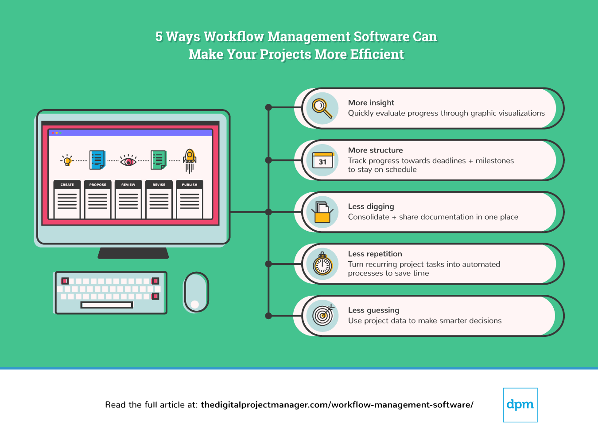
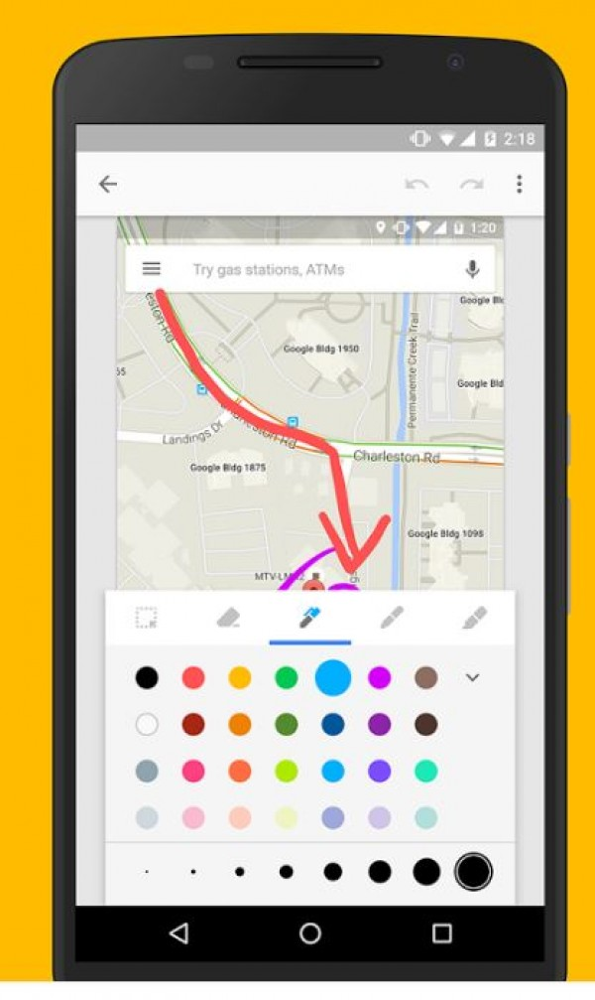
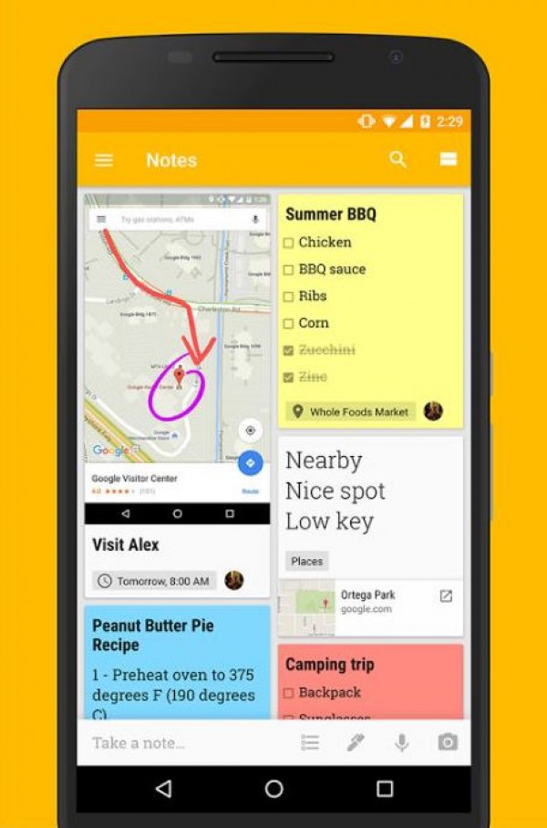

Be productive is what we all want. It is a way to be fast, effective, and efficient. Be productive is the secret of success and the formula to get better your processes, your business, and overcome yourself day by day. Be productive is possible by maintaining efficient **workflows in your business** and your personal life, and we want to give you some tools and tips to do it easily.

<title-2>Everything you have to know about an efficient workflow</title-2>

Workflow is a pattern of actions or steps that you repeat constantly to do work or finishing a process. 

This pattern is involved in daily activities, methods, information, people, resources, the ability to handle daily tasks, tools, etc. 

It is a tool that makes the processes and activities in your company works in a good or a bad way, depending on how you are implementing it. 

Some years ago workflows were controlled by a physical person and all teams used tools like blackboards, notes, messages, and lists to maintain the efficiency. 

But now, thanks to technology everyone forgot those tools and now we have digital workflows where we have management tools that allow setting business rules to dictate when one step can be taken as successfully completed and the next step can be triggered. In that form, the workflow is automated and that translates on more efficiency.

<title-2>How to improve an efficient workflow</title-2>

Source: [digital project manager](https://thedigitalprojectmanager.com/workflow-management-software/)

<title-3>1. Say goodbye to multitasking</title-3>

If you want a team focused and really productive, it is imperative to assign specific tasks. That doesn’t mean that a person is not able to do more than one task. For sure he or she can do it, but they will be more efficient if they have one first and then the other. They will end faster and better every task. 

If you begin one task and you finish it to begin the other, you will work better.

<title-3>2. Finish first more difficult tasks</title-3>

More complex and difficult tasks need more concentration. So, they take more time. Once you finish them, it will be easier to complete the others faster. 

<title-3>3. Improve communications</title-3>

Being efficient also is thanks to good and constant communication between the people working around the same area, project or tasks and you can do it using the right tools.

Tools like [Slack](https://slack.com/intl/es/), where you can have a grupal channel for communication or private channels you talk with each member of your team directly, immediately, fastly, and effectively.

<title-3>4. Schedules are your best friend</title-3>

You and your team need to know in every moment in what they are working and which tasks they need to do during the day, the week, even the month. In that way, they plan how to accomplish them. All of this is possible to do it and to keep it with schedules. 

There are really nice tools as Google Calendar, Trello, Evernote, etc, that can help you with this.

<title-3>5. Be as transparent you can</title-3>

You can make public all assignments you make using a workflow tool. In that way, everyone in your team would work as a network. 

Another good reason to do it is that all people in your team will know in what is working his or her partners. That is transparency.

<title-3>6. Define and respect roles</title-3>

If everyone knows which work they need to do, they will be able to finish faster and more effectively. The action of assign and choose a responsible for every task is call:  **role definition**.

<title-3>7. If there is a tool that gets easier the work and the organization, use it!</title-3>

This is maybe one of the most important things you could do to maintain an efficient workflow in your team, company, etc.  

We recommend you to read and search daily all tools that are being released and can help you to improve your workflow. They will make you more efficient, and the best, they will help you to win more money faster. 

We are going to describe some of them:

 

**Tools you can use for keeping a good workflow**

* **Trello**

It is a project management application that will do your work and your life easier. 

Trello has a variety of work and personal uses including real estate management, software project management, school bulletin boards, lesson planning, accounting, web design, gaming, and law office case management.

Source: [Wikipedia](https://en.wikipedia.org/wiki/Trello)

Trello is very visual. The whole team can see the every estate of task and even collaborate to accomplish it. That's one of the benefits of this tool. Tasks can be assigned to one person, but the other team members can participate later. It has the perfect balance between individual and team work. 

And all of that without mentioning the synchronization with all the devices that you have. Trello is the most common tool used for tasks management in the world. 

Trello has a free plan where you can have boards, list, checklists, power-ups for each board, you can synchronize with other accounts as Google Drive, and you have until 10 mb for add documents or archives. 

Also, It has a business plan where you have the same specifications, with 250 mb of capacity, premium power-ups, you can restrict the access to old members, you can make public and private boards, you have a better attention by email, and It is safer. This plan has a cost of $9,99 per month if you pay the anuality. 

The last plan you can have in trello it is the enterprise. You can have two factor authentication, more cybersecurity, and other benefits in comparison with the last. This plan you can have it for $20,83 monthly.

* **Slack**

Slack is a cloud-based set of proprietary team collaboration tools and services. [Wikipedia](https://en.wikipedia.org/wiki/Slack_(software)).

There you will have messaging services, where you can create groups, communities, teams of people, and you can make integrations with other software as Google Drive, Trello, Dropbox, Box, Heroku, IBM Bluemix, Crashlytics, GitHub, Runscope, Zendesk, etc. 

“Slack for teams is ideal for small- to medium- sized companies or teams who only need a single Slack workspace. You can use Slack with a limited number of features for free, but if you need more features and functionality, they offer two paid plans.” [Slack](https://get.slack.help/hc/en-us/articles/115003205446-Planes-productos-y-funciones-)

Source: [Slack](https://get.slack.help/hc/en-us/articles/115003205446-Planes-productos-y-funciones-)

* **Google Keep**

Everything you need to write you can save it in [Google Keep](https://keep.google.com/u/0/). Google Keep is a note-taking service developed by Google.

You can include texts, images, videos, audios, lists, and many elements to take your notes in your private life and in your work. 

Even users can set reminders, which are integrated with Google Now, with options for time or location.[Wikipedia](https://en.wikipedia.org/wiki/Google_Keep)

“Google Keep helps the users in sharing ideas with friends, family and colleagues since it allows collaboration in real time. Users can also record a voice memo and Google Keep will transcribe it so that it can be searched from time to time. It also allows users to set reminders for notes at a particular time or when they reach a particular place".[SoftwareAdvice](https://www.softwareadvice.com/project-management/google-keep-profile/)

In Google keep you also can organize data, create to-do lists, draw on images, and capture thoughts.

Source: [SoftwareAdvice](https://www.softwareadvice.com/project-management/google-keep-profile/)

* **KissFLOW**

“This is a cloud-based solution that helps users easily design, create, and customize business apps. It takes a lightweight approach to BPM and places the power of creating workflows back in the hands of users who understand the issues best”.

KiSSFLOW comes with about 50 pre-installed business applications such as employee onboarding, purchase orders, mileage reimbursement, vendor payment, and many more. Users can either install these apps and edit them to their preferences, or they can build their own from the ground up. The business application also includes a form to capture data, a workflow with a sequence of system and human task, reports, and notifications.

Source: [Financesonly](https://reviews.financesonline.com/p/kissflow/)

This tool has a free plan, an two paid. The first paided is the kissFLOW plan, which has a cost of $9 per month while the second one is the enterprise, but they don't show the price. If you want you know it you have to communicate with the vendor.

<youtube-video id=""></youtube-video>

Source:[Wikipedia](https://en.wikipedia.org/wiki/IOS)

<youtube-video id="bUQz9ZWjsvc"></youtube-video>
