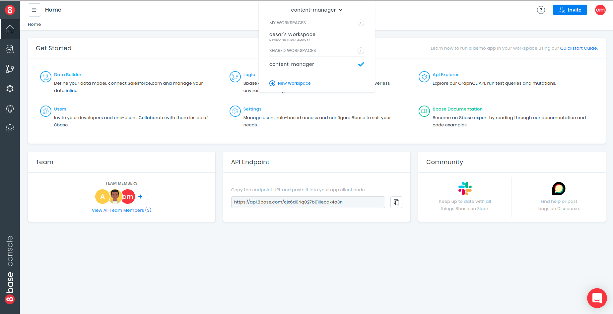
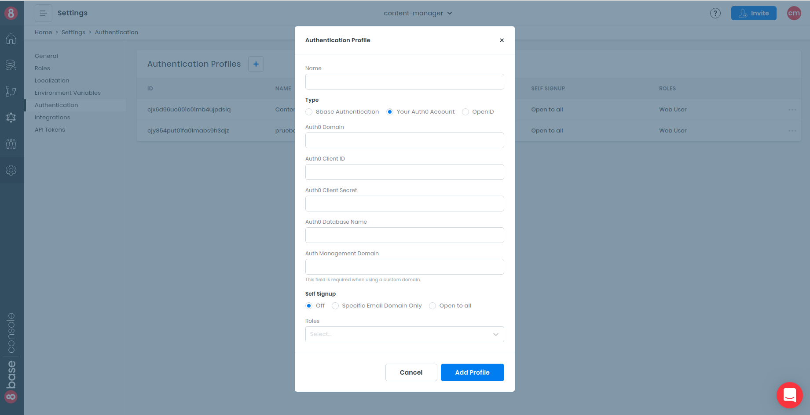

## 8base

**8base** is a Backend-as-a-Service. It lets front-end developers focus more on what they love and backend developers expedite their workflow. As our CEO likes to say, "it's totally awesome!"

When using 8base, you're project benefits from having:

1. A fully scalable serverless API
2. A managed MySQL Database that's hosted on AWS
3. Ready-to-use app services, like Authentication, Authorization, and File Storage
4. 8base's rock-star team and the Community
5. So, so, so much more!

<https://docs.8base.com/getting-started/getting-started>

## Connect to 8base

### 1. Create an account at 8base

create an account in 8base is easy just go to this [link](https://app.8base.com/) we send you a confirmation email

### 2. Setting up a Workspace

when you create an account 8base give you a free workspace for 30, but if you want to create a new workspace just click on the drop down menu "New workspace". Name it however you want, select the plan you want and you're done.



### 3. Create the Authentication provider

Under the hood, 8base utilizes Auth0 to manage your users' identities and ensure the best security standards.But in this tutorial we will use our own auth0 account

first we go to [auth0](https://auth0.com/) official page we create an account.We go dashboard and click where it says "CREATE APPLICATION" and follow the steps that tell us

Once created our auth0 account we will connect it to 8base

Once created our auth0 account we are going to connect it to 8base .in the 8base console we go to Settings then to Authentication and we create a new authenticaicon profile, we fill the form and ready.



### 4. The best way to start with 8base for the first time is to go to the 8base [documentation](https://docs.8base.com/getting-started/quick-start) and Clone the Demo Repository. They have on for React and one for Vue

    git clone https://github.com/8base/react-8base-starter-app.git

### 5. Then we go into the project folder and do an npm install

### 6. Setting up the client

    APP_WORKSPACE_ENDPOINT=<workspace_endpoint>
    APP_AUTH_PROFILE_ID=<auth_profile_id>
    APP_AUTH_CLIENT_ID=<auth_client_id>
    APP_AUTH_DOMAIN=<auth_domain>

Look for a 8base-starter-app/client/.env file that contains a template for the required environment variables. Fill in the template with all appropriate values. Each starter app will have a thorough READme.md with instructions on which files are responsible for which functionality. Please read them!

### 7. Run the application with the NPM STAR command

## To execute a query

```javascript
import React from 'react'
import { useQuery } from '@apollo/react-hooks'
import gql from 'graphql-tag'

const TASK_LIST_QUERY = gql`
  {
    tasksList {
      count
      items {
        name
        description
        createdAt
      }
    }
  }
`

const Home = () => {
  const { data, loading, error } = useQuery(TASK_LIST_QUERY)
  console.log(`DEBUG:`, data, loading, error)

  if (loading === true) return <div className={'loading'}>Loading...</div>

  const {
    tasksList: { items },
  } = data

  return (
    <div>
      <h1>Tasks!</h1>
      {items.map((task, i) => (
        <p key={i}>{task.name}</p>
      ))}
    </div>
  )
}
```

### Let's explain what we did here

- We imported React
- We import useQuery from @apollo/react-hooks that is not used to make the query
- We import graphql-tag gql that will help us write the query
  In the **TASK_LIST_QUERY** constant we store the query using gql
- We created a functional component called **Home**
  Inside that component we make a destructuring of objects to useQuery ue resive as prametro the constant that we created
- We ask if loading exites and return a div indicating the load
- We make a double desestructuration to **data** and extract **item**
- Finally we return a div with all the names of the list
