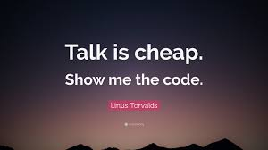

How good is an application that does not send notifications? not so much right?. 

Continuing our previous example of [Our First JSON REST API using Flask](https://cobuildlab.com/development-blog/my-first-json-rest-api-with-flask/) we will add notifications via SMS capabilities to our app to let people know when something important happens.

## Notifications

Modern Software Applications require a way to communicate events to the outside world. Examples: 

- Sign ups
- Payments overdue
- Password Changed
- New message received
- Tasks assigned, etc

As of today, many ways of communication exists for this purpose: SMS, Email, Instant Messaging, Push notifications for web or mobile.


In this specific case, we will review sending SMS notifications using the Twilio platform.


### Flask Framework

Flask is a micro web framework written in Python. It is classified as a microframework because it does not require particular tools or libraries (except for some basics standard libraries such as bottom.py). It has no database abstraction layer, form validation, or any other components where pre-existing third-party libraries provide common functions. However, Flask supports extensions that can add application features as if they were implemented in Flask itself. Extensions exist for object-relational mappers, form validation, upload handling, various open authentication technologies and several common framework related tools. Extensions are updated far more regularly than the core Flask program.[5] Flask is commonly used with MongoDB, which gives it more control over databases and history. 


### Twilio

is a cloud communications platform as a service (CPaaS) company based in San Francisco, California. Twilio allows software developers to programmatically make and receive phone calls, send and receive text messages, and perform other communication functions using its web service APIs.

From [Wikipedia](https://en.wikipedia.org/wiki/Twilio)

Twilio capabilities include:

- Send and Receive SMS Messages
- Send and Receive phone Calls
- 




These instructions are based on the [Official Python Twilio Site](https://www.twilio.com/docs/libraries/python)

### 1. Create a Twilio Account:

Go to: [https://www.twilio.com/try-twilio](https://www.twilio.com/try-twilio) and Complete the steps


### 2. Click on GET A TRIAL NUMBER

- Accept the Number that Twilio is providing

### 3. Install PIP if you haven't

```bash
curl https://bootstrap.pypa.io/get-pip.py -o get-pip.py
python get-pip.py
pip3 --version
```

### 4. Install Python Twilio library:

```bash
pip3 install twilio
# Additional Requirements
pip install -r requirements.txt
```

### 5. Create the Endpoint to send an SMS

apps.py

```python
#!flask/bin/python
from flask import Flask, jsonify
from twilio.rest import Client
import os

account_sid = 'AC75c8d93aa37257e96dfa34627a5fe947'
auth_token = 'your_auth_token'
client = Client(account_sid, auth_token)

app = Flask(__name__)

tasks = []

@app.route('/todo/api/v1.0/create-task', methods=['GET'])
def create_task():
    tasks.append({"id": len(tasks), "title": "Learn Python", "description": "Start with Flask first", "done": False})

    message = client.messages \
                    .create(
                         body="A Task was created",
                         from_='+17866003378',
                         to='+17869913467'
                     )
    return jsonify({'tasks': tasks})

if __name__ == '__main__':
    app.run(debug=True)
```

# 5. Run the app

```sh
chmod a+x app.py
python3 app.py
```