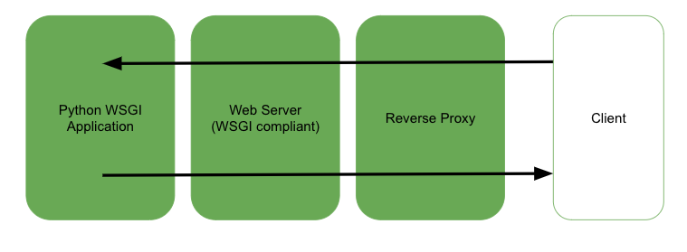

At next we will explain the practical way of deploying Python WSGI applications on production servers using the powerful and popular Docker tools.

Many popular Python frameworks such as Django and Flask provide a WSGI implementation to connect to a web server, and suggest this as the prefer way of deployment.

## WSGI

[WSGI] (https://wsgi.readthedocs.io/en/latest/what.html) is a Python specification that describes how a web server communicates with web applications, and how web applications can be chained together to process one request.

Back in 2003, Python web framworks were typically written on a variaty of interfaces against web servers like CGI or mod_python.

In December of that year the [PEP 333] (https://www.python.org/dev/peps/pep-0333/) was introduced to convey in the way that a Python framework should communicate with a webserver, to provide a common ground on development of this area.

In a glance, a production architecture of a Python web application should look like this:



1) Setup a Django WSGI Application (a normal Django Application)
2) Setup a WSGI compliant Web Server
3) Setup a reverse proxy 
4) Setup a Docker container using Docker compose


## Django

[Django] (https://www.djangoproject.com/) is a high-level Python Web framework that encourages rapid development and clean, pragmatic design. Built by experienced developers, it takes care of much of the hassle of Web development, so you can focus on writing your app without needing to reinvent the wheel. It’s free and open source.

Django it's my preferred way of development for REST API for three primary reasons:

1) It written in Python, that it's a very clean language
2) Together with [Django Rest Framework] (https://www.django-rest-framework.org/) It has 90% of the the tools that you need to develop a REST API
3) It has a huge community, and it has been around enought time to get help on almost any problem that you encounter.

## WSGI Compliant Web Server

Basically a web server that has a module to communicate with a WSGI application.

We use this component to translate incoming HTTP request in to WSGI specification.

For our example we will use [GUNICORN] (https://gunicorn.org/) that uses a pre-fork work model.

## Reverse Proxy

It is a common pattern to put in front of your architecture a stable and solid with server with reverse proxy capabilities, to handle advanced escenarios in your architecture, like:

- SSL certificates
- Proxy
- Load Balancing
- Caching
- Static Resources

For this example we will use NGINX


## Docker

>>> Docker provides container software that is ideal for developers and teams looking to get started and experimenting with container-based applications [Source] (https://www.docker.com/)

Nowadays its very common to use a container tool to develop and release code to production. Containters give you several benefits:

- Virtual Machine Architecture: that enables run the same container in any OS
- An easy development and deployment
- Descriptive configuration to share among developers evniroment
- Enables container orchestration, a powerfull techinique for achieve high scalability


# Let's see the code

For this example we will use a Ubuntu 18.04 VPS.

## Steps to deploy:

### 1) Docker and Docker compose

We create to files in the root of our Django Application:

A `Dockerfile` for the Python web application, with gunicorn

```bash
FROM alpine
# init
RUN mkdir /app
WORKDIR /app
COPY requirements.txt /app/
# setup
RUN adduser -D deploy
RUN apk update
RUN apk upgrade
RUN apk --no-cache add \
    python3 \
    python3-dev \
    postgresql-client \
    postgresql-dev \
    build-base \
    gettext jpeg-dev zlib-dev
RUN pip3 install --upgrade pip
RUN pip3 install -r requirements.txt
RUN pip3 install gunicorn
# clean
RUN apk del -r python3-dev postgresql
# prep
ENV PYTHONUNBUFFERED 1
COPY . /app/
```

A `docker-compose.yml` to describe the deployment

```yml
version: "3"
services:
  web:
    build: .
    hostname: localhost
    user: deploy
    restart: always
    env_file:
      - ./.env
    command: sh start.sh
    volumes:
      - .:/app
    ports:
      - "8080:8080"
```

The startup script: `start.sh` to start the services

```bash
#!/bin/sh

python3 manage.py migrate --no-input
django-admin compilemessages
gunicorn --bind 0.0.0.0:8080 massone.wsgi
```

### 2) We install docker in our Ubuntu VPS

```bash
#!/usr/bin/env bash

sudo curl -fsSL https://download.docker.com/linux/ubuntu/gpg | sudo apt-key add -
sudo add-apt-repository "deb [arch=amd64] https://download.docker.com/linux/ubuntu $(lsb_release -cs) stable"
sudo apt-get update
apt-cache policy docker-ce
sudo apt-get install -y docker-ce

sudo usermod -aG docker deploy

sudo curl -L https://github.com/docker/compose/releases/download/1.23.1/docker-compose-$(uname -s)-$(uname -m) -o /usr/local/bin/docker-compose
sudo chmod +x /usr/local/bin/docker-compose
```

### 3) Set the Enviroment variables

Create a `.env` file :


```bash
DEBUG=True
DBUSER=postgres
DBNAME=
DBPASSWORD=
DBHOST=127.0.0.1
DBPORT=5432
EMAIL_TLS=true
EMAIL_PORT_USE=587
EMAIL_USER=
EMAIL_PASSWORD=
EMAIL_HOST=smtp.gmail.com
URL=http://127.0.0.1:8000
BROKER_TRANSPORT=redis
BROKER_HOST=localhost
BROKER_PORT=6379
BROKER_VHOST=0
CELERY_RESULT_BACKEND=redis
CELERY_REDIS_HOST=localhost
CELERY_REDIS_PORT=6379
CELERY_REDIS_DB=0
LOG_FOLDER=logs
ROLLBAR=
DIGITAL_OCEAN_ACCESS_ID=
DIGITAL_OCEAN_SECRET_KEY=
DIGITAL_REGION=
DIGITAL_ENDPOINT_URL=
BUCKET_NAME=
DIGITAL_URL_PROFILE=
```

### 4) Setup the Nginx Reverse Proxy

Install nginx and configure the `sites-available/` to point to the gunicorn expose port.

### 5) Optimize if necesary

- SSL configuration
- Available NGINX or GUNICORN workers
- Replication