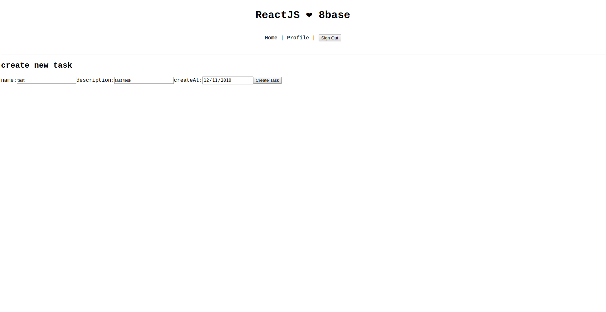
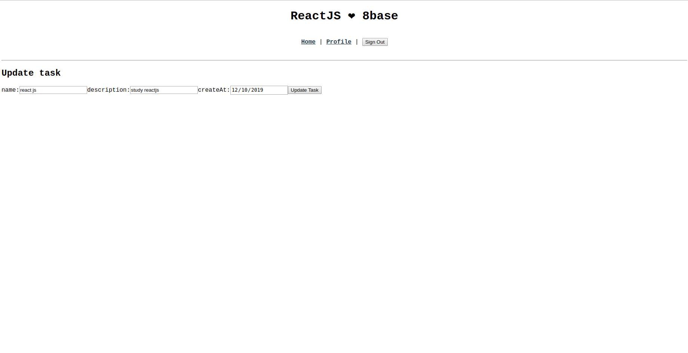

## 8base

**8base** is a Backend-as-a-Service. It lets front-end developers focus more on what they love and backend developers expedite their workflow. As our CEO likes to say, "it's totally awesome!"

When using 8base, you're project benefits from having:

1. A fully scalable serverless API
2. A managed MySQL Database that's hosted on AWS
3. Ready-to-use app services, like Authentication, Authorization, and File Storage
4. 8base's rock-star team and the Community
5. So, so, so much more!

### Connect to 8base

In a previous article we saw in depth everything necessary to create an account and configuration, you can review the article [here](connect-to-8base-and-make-a-query.md)

Continuing with the previous article we are going to learn how to perform a mutation in order to create and update our list of tasks.

### Creating the files

In the path `src/routes/home/` we are going to create two files , NewTask and TaskUpdate.

In the newTask file we are going to paste the following code

```javascript
import React, { useState } from 'react'
import { useMutation } from '@apollo/react-hooks'
import gql from 'graphql-tag'

const TASK_LIST_MUTATION = gql`
  mutation($data: TaskCreateInput!) {
    taskCreate(data: $data) {
      id
    }
  }
`

const Newtask = props => {
  const [name, setName] = useState('')
  const [description, setDescription] = useState('')
  const [date, setDate] = useState('')
  const [createTask] = useMutation(TASK_LIST_MUTATION, {
    onCompleted: () => {
      props.history.push('/')
    },
  })

  const createNewTask = async e => {
    e.preventDefault()

    if (name === '' || description === '' || date === '') {
      console.log('error')
      return
    }

    const variables = {
      data: {
        name,
        description,
        createAt: date,
      },
    }

    try {
      await createTask({ variables })
    } catch (error) {
      console.log('ERROR', error)
    }
    return true
  }

  return (
    <div>
      <h2>create new task</h2>
      <form>
        <label>
          name:
          <input
            type="text"
            placeholder="task Name"
            onChange={e => setName(e.target.value)}
          />
        </label>
        <label>
          description:
          <input
            type="text"
            placeholder="task description"
            onChange={e => setDescription(e.target.value)}
          />
        </label>
        <label>
          createAt:
          <input type="date" onChange={e => setDate(e.target.value)} />
        </label>
        <button onClick={createNewTask}>Create Task</button>
      </form>
    </div>
  )
}

export { Newtask }
```


We created a component called NewTask that I know how to create the tasks

In the TaskUpdate file we will be able to update the tasks

```javascript
import React, { useState } from 'react'
import { useMutation, useQuery } from '@apollo/react-hooks'
import gql from 'graphql-tag'

const TASK_UPDATE_MUTATION = gql`
  mutation($data: TaskUpdateInput!, $filter: TaskKeyFilter) {
    taskUpdate(data: $data, filter: $filter) {
      id
    }
  }
`

const TASK_LIST_QUERY = gql`
  query($id: ID) {
    task(id: $id) {
      name
      description
      createAt
    }
  }
`

const TaskUpdate = props => {
  const ID = props.match.params.id
  const { data, loading, error } = useQuery(TASK_LIST_QUERY, {
    variables: { id: ID },
  })
  const [name, setName] = useState('')
  const [description, setDescription] = useState('')
  const [date, setDate] = useState('')
  const [updateTask] = useMutation(TASK_UPDATE_MUTATION, {
    onCompleted: () => {
      props.history.push('/')
    },
  })

  if (loading === true) return <div className={'loading'}>Loading...</div>

  const taskUpdate = async e => {
    e.preventDefault()

    if (name === '' || description === '' || date === '') {
      console.log('error')
      return
    }

    const variables = {
      filter: {
        id: ID,
      },
      data: {
        name,
        description,
        createAt: date,
      },
    }
    try {
      await updateTask({ variables })
    } catch (error) {
      console.log('ERROR', error)
    }
    return true
  }

  const { task } = data
  return (
    <div>
      <h2>Update task</h2>
      <form>
        <label>
          name:
          <input
            type="text"
            onChange={e => setName(e.target.value)}
            defaultValue={task.name}
          />
        </label>
        <label>
          description:
          <input
            type="text"
            onChange={e => setDescription(e.target.value)}
            defaultValue={task.description}
          />
        </label>
        <label>
          createAt:
          <input
            type="date"
            onChange={e => setDate(e.target.value)}
            defaultValue={task.createAt}
          />
        </label>
        <button onClick={taskUpdate}>Update Task</button>
      </form>
    </div>
  )
}

export { TaskUpdate }
```


